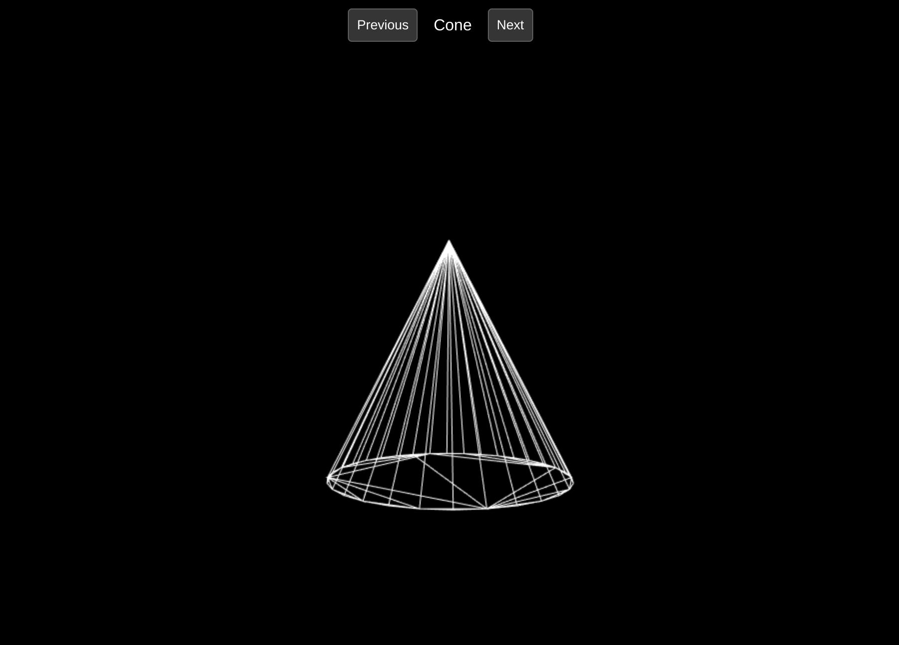

# Line 3D

Just an experiment to see if I can render an obj file as a wireframe in JS canvas

## How to run?

1. Make sure that you have Node JS, and PNPM package manager.
2. Run `pnpm install`
3. Run `pnpm dev`
4. Open browser to `http://localhost:5173`
